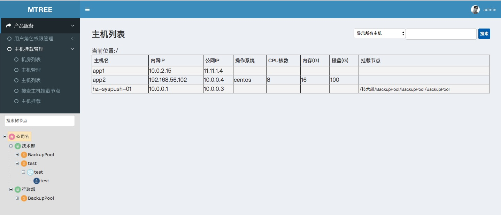

# Mtree

运维云平台之服务树（业务树），Mtree是基于Python、Django和Ztree开发的，服务树是运维云平台的基石<br>
一般情况服务树需要和CMDB及角色权限管理整合使用，否则这棵树是无意义的，所以把CMDB和角色权限管理整合发布<br>
为实现方便DMEO演示，CMDB在本系统中是实现了IDC机房及主机的增删改查功能<br>
实际线上环境使用需要在后台定时任务同步主机信息，如从阿里云同步主机IP及主机名等基础信息，再利用saltstack的 grains模块收集更新主机CPU，内存等系统信息 

### 部署运行环境
* Centos6.5 x86_64
* saltstack master
* Python2.7
* Virtualenv
* Django1.9.2
* Rabbitmq-server

### 安装部署

```
cd mtree
sh update_python2.7.8.sh 
yum install rabbitmq-server -y
/etc/init.d/rabbitmq-server start
chkconfig rabbitmq-server on
pip install virtualenv
virtualenv ./env
source env/bin/activate
pip install -r pip_requirements.txt
python manage.py makemigrations
python manage.py migrate
python init.py
vim mysite/settings.py #手动修改配置SYS_API和EMAIL等配置
sh service.sh start
```

### 使用
1. 访问http://你的主机IP:8000 默认账户：admin 密码：password
2. 添加系统用户
  * 添加系统用户：点击右上角用户图标 --> 后台中心 --> 点击用户表添加用户 [注意：姓氏(last_name)填用户全名]
  * 将新添加系统用户加入mtree_admin角色中，业务树管理员可以管理业务树角色列表用户的权限
  * 用户角色权限管理 --> 业务树角色列表 --> 选择业务树节点 --> 添加用户OP或OP_ADMIN权限
3. 树节点管理
  * 树根节点默认为公司名，右键修改名称及增加添加子节点（只有OP及OP_ADMIN可以对已授权的树节点及该节点下的所有子节点有增删改权限）
  * 在创建第一级节点时系统会自动创建该节点备机池，不能手动删除，否则系统会报错
  * 默认树节点最大四级，在配置文件里可配置，最后一级节点为主机挂载节点，如果树节点及子节点下有挂载了主机的节点是不是能直接删除的
  
### 截图


### 技术交流

Email：飞龙 <hhr66@qq.com>
